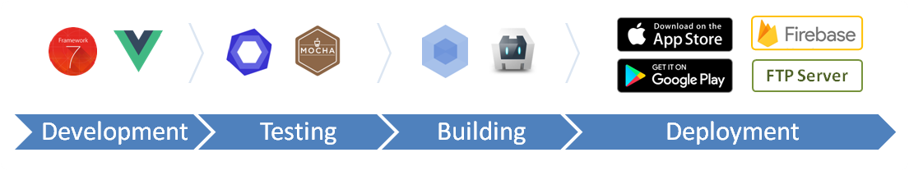

# App Framework &nbsp; &nbsp; &nbsp;   

**iOS and Android Apps with HTML & JavaScript - App Framework combines great pieces of open source code to support your whole workflow with useful scripts and your app with powerful plugins. With App Framework, you could spend your time for your next amazing App and not for the tricky stuff around - free and open source!**

## Basic Features

- **Beautiful UI** - with all well-known components and transitions, based on [Framework7](https://framework7.io/)
- **Single file components** - [easy to maintain](https://vuejs.org/guide/single-file-components) with [reusable UI elements](https://framework7.io/vue/), based on [Vue.js](https://vuejs.org/)
- **One code base** - for iOS, Android and the web, realized with [Cordova](https://cordova.apache.org/), supporting [ES2015](https://babeljs.io/learn-es2015/)
- **Flexible routing** - with [parameters, nesting](http://framework7.io/vue/navigation-router.html) and login protection
- **Global data object** - to be used for app-wide persistent storage of data and preferences
- **Offline capability** - to use your app offline in the browser or as homescreen app
- **Multilingual capability** - to offer your app in several languages
- **Local development** - on a local server with live update, made for [Chrome DevTools](https://developers.google.com/web/tools/chrome-devtools/)
- **Native development** - on an emulator for iOS or Android or your own device
- **Integrated tests** - for [code](https://eslint.org/), [units](https://mochajs.org/) and [coverage](https://istanbul.js.org/)
- **Icon creation** - of favicons, touch icons and splash screens out of a single image file
- **Optimized builds** - for good scores at [Google Lighthouse](https://developers.google.com/web/tools/lighthouse/) or [YSlow](http://yslow.org/)
- **Downtime-free deployment** - to [Xcode](https://developer.apple.com/xcode/), [Android Studio](https://developer.android.com/studio), [Firebase](https://firebase.google.com/products/hosting/) and any FTP server
- **Backup solution** - for your project folder, [Firebase database content](https://firebase.google.com/products/database/) and [Firebase user list](https://firebase.google.com/products/auth/)
- **Lightweight project folder** - well organized and ready to publish on [GitHub](https://github.com/about)
- **Printable templates** - design your app with paper and pencil

## Plugin Features

- **iconsFontAwemsome** - to use the [FontAwesome](http://fontawesome.io/) icons
- **iconsFramework7** - to use the [Framework7](http://framework7.io/icons/) icons
- **iconsIon** - to use the [Ion](http://ionicons.com/) icons
- **iconsMaterial** - to use the [Material Icons](https://material.io/icons/)
- **firebaseAuth** - to use the [Firebase authentication](https://firebase.google.com/products/auth/) service
- **firebaseDatabase** - to use the [Firebase realtime database](https://firebase.google.com/products/auth/) service
- **firebaseStorage** - to use the [Firebase file storage](https://firebase.google.com/products/auth/) service
- **firebaseFirestore** - to use the [Firebase document storage](https://firebase.google.com/products/auth/) service
- **restoreHistory** - to restore the app page history in all views
- **restoreTabs** - to restore selected tabs on all pages
- **restoreScrollPositions** - to restore scroll positions on all pages
- **restorePanels** - to restore opened side panels
- **restorePopups** - to restore opened popups
- **restoreFormData** - to restore entered form data and focus
- **preloadImages** - to load all images before application start
- **preloadFonts** - to load all fonts before application start
- **phoneFrame** - to offer desktop access with charm

## Workflow Commands

Development

- `npm run dev` to start a development server with hot reload
- `npm run dev:ios` to open a development build on an iOS emulator
- `npm run dev:android` to open a development build on an Android emulator
- `npm run dev:firebase` to deploy a development build to Firebase
- `npm run dev:ftp` to deploy a development build to a FTP server

Testing

- `npm run test` to run all tests according the configuration
- `npm run test:code` to check and fix the code
- `npm run test:units` to run all unit tests
- `npm run test:coverage` to check the test coverage

Building

- `npm run build:patch` to build version x.y.z+1
- `npm run build:minor` to build version x.y+1.0
- `npm run build:major` to build version x+1.0.0

Deployment

- `npm run deploy` to deploy the latest build according the configuration
- `npm run deploy:ios` to deploy the latest build to Xcode
- `npm run deploy:android` to deploy the latest build to Android Studio
- `npm run deploy:firebase` to deploy the latest build to Firebase
- `npm run deploy:ftp` to deploy the latest build to a FTP server

Backup

- `npm run backup` to create a backup according the configuration

## Requirements

Knowledge

- [Node.js and npm](https://docs.npmjs.com/getting-started/what-is-npm) for command line interface handling
- [Framework7](https://framework7.io/docs/) and [Framework7-Vue](https://framework7.io/vue/) to develop with HTML and JavaScript
- [Vue.js](https://vuejs.org/v2/guide/) if you want to make your application state-based and reactive
- [Firebase](https://firebase.google.com/docs/web/setup) if you want to use the reliable backend service provider
- [Cordova/PhoneGap](https://cordova.apache.org/docs/en/latest/) if you want to use device hardware API plugins
- [iOS design guidelines](https://developer.apple.com/ios/human-interface-guidelines/overview/design-principles/) and [Material design guidelines](https://material.io/guidelines/) if you want to be conformable

Software

- [Atom.io](https://atom.io/) as the recommend code editor
  - Package *language-vue-component* to support .vue files
  - Package *linter-eslint* to support live code checking
- [Node.js and npm](https://nodejs.org/) as JavaScript runtime environment
- [Xcode](https://developer.apple.com/xcode/) if you want to deploy to the App Store (requires macOS)
- [Android Studio](https://developer.android.com/studio/install.html) if you want to deploy to the Play Store

## Quick Start

1. Run `mkdir my-app` to create a new project folder
2. Run `cd my-app` to open the project folder
3. Run `echo {} > package.json` to create the package information file
4. Run `npm install --save-dev app-framework` to install App Framework and setup the project folder
5. Run `npm run dev` to open the app on the development server

## Documentation

Please read our  for detailed information.

## Demo App

&nbsp;&nbsp;&nbsp;

&nbsp;&nbsp;&nbsp;

